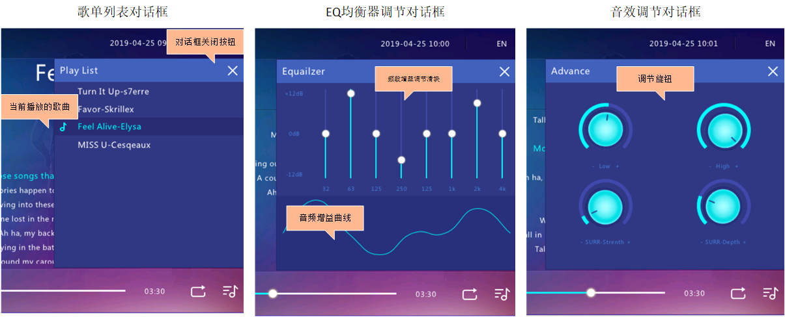

#User Manual

​	本手册适用于[预发布版本Beta1.0](https://github.com/LiangJinlongFX/AWTK_MusicDemo/releases/tag/Beta1.0)程序的使用说明。

​	界面控件介绍

### 运行环境

​	操作系统：Windows 32/64位

### How to USE

+ **加载音乐文件**

  ​	在exe同级目录下的audiofiles文件夹中存放你要播放的MP3文件，程序在启动时会自动加载./audiofiles下的MP3文件。

+ **音乐播放控制**

  ​	点击播放按钮，便可切换当前音乐的播放状态为播放或者暂停状态。

  ​	如果你要快速让音乐跳到指定位置播放，请按住进度条上的小圆点，拖拽到指定的播放位置然后释放。

+ **音乐选择以及切换歌曲**

  1. 通过点击上一首/下一首按钮实现
  2. 打开歌单列表对话框，点击要播放的歌曲名称即可实现切换到指定的歌曲

+ **播放模式设置**

  ​	本系统支持顺序播放、随机播放和单曲循环三种播放模式，通过点击音乐模式按钮以切换到不同的播放模式。

  ​	*值得注意的是，在随机或者单曲循环模式下，当你在歌单中选择了新的歌曲播放时，系统会自动切换回顺序播放模式*

+ **系统语言切换**

  ​	本程序支持系统栏以及对话框的标题栏文本切换到不同的国家语言，只需通过点击右上角的语言切换按钮即可。

+ **音效调节**

  默认情况下，音效调节按钮均处于隐藏状态，如要使用请点击设置按钮让音效按钮显示并启用。

  + EQ均衡器调节

    *如果你需要改变音乐某特定频段的增益，请使用此功能*

    ​	EQ调节支持32/63/125/250/500/1k/2k/4k八个特定的频段的增益调节。如果你需要改变某一特定的频段音频增益，请拖拽滑块，此时频段增益会随之改变，对话框内的增益曲线也同时表现出你所调整的音频增益情况。

  + 音效调节

    *如果你需要调节Pitch(音高)、Rate(播放速率)、Tempo(节奏)和播放音量，请使用此功能*

    ​	操作的方式有点特别？你需用鼠标按住按钮，然后往你想要调节的方向拖动鼠标，然后释放鼠标，就完成了调节，旋钮边缘显示了当前设计的参数值。

